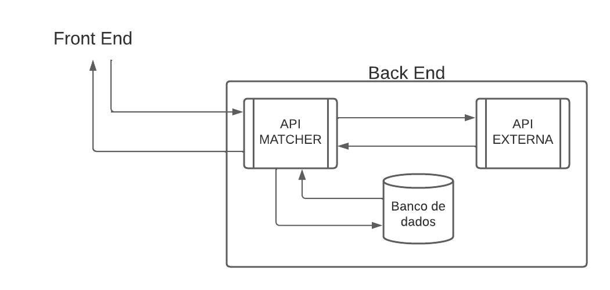
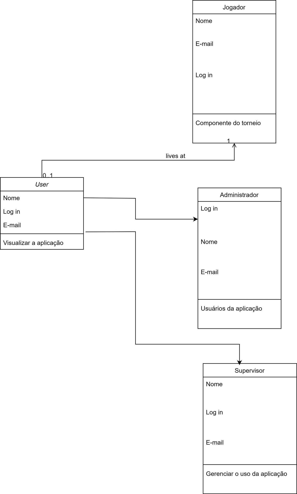
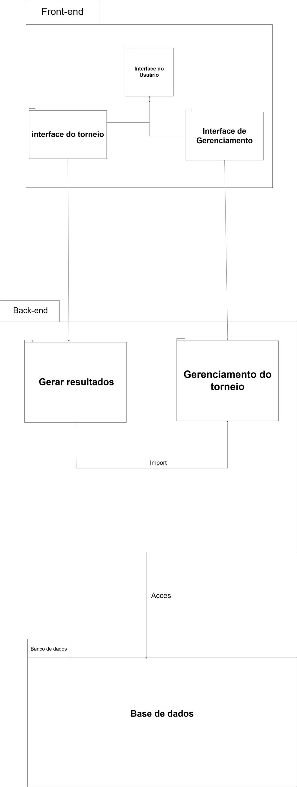
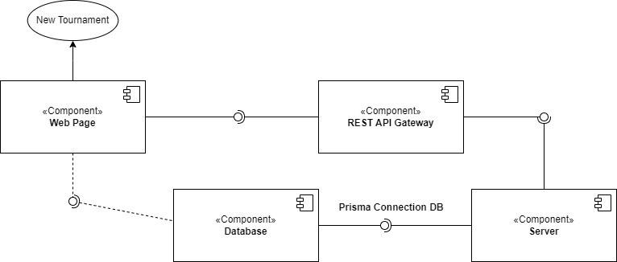

## Histórico de Revisão

| Data       | Versão | Descrição                                   | Autor(es)    |
| ---------- | ------ | ------------------------------------------- | ------------ |
| 31/10/2023 | 1.0    | Primeira versão do documento de arquitetura | Todo o grupo |

### Autores: 

| Matrícula | Nome       | Descrição do papel assumido na equipe | % de contribuição ao trabalho |
| --------- | ---------- | ------------------------------------- | ----------------------------- |
| 200037170 | Fábio A.   | Desenvolvedor                         | 14,28%                        |
| 180053299 | João E.    | Desenvolvedor                         | 14,28%                        |
| 211031074 | João P.    | Desenvolvedor                         | 14,28%                        |
| 190091703 | Lucas H.   | Scrum Master                          | 14,28%                        |
| 190016647 | Lucas O.   | Product Owner                         | 14,28%                        |
| 211062830 | Philipe B. | Tech Lead                             | 14,28%                        |
| 180108875 | Rodrigo M. | Desenvolvedor                         | 14,28%                        |

## Introdução

### Propósito

O presente documento descreve a arquitetura do sistema Matcher, sendo desenvolvido pelo grupo Sirius, na disciplina de MDS - Métodos de Desenvolvimento de Software - edição do segundo semestre de 2023. O documento serve para fornecer uma visão abrangente do sistema para desenvolvedores, testadores e demais interessados.

### Escopo

Em linhas gerais, o Matcher é um sistema de software que se preocupa com o chaveamento de torneios de e-sports. O detalhamento do nosso escopo se encontra no arquivo "escopo-sirius.pdf", na [pasta raíz do nosso projeto](https://github.com/FGA0138-MDS-Ajax/2023-2-SIRIUS). O escopo completo também pode ser encontrado [no nosso gitpages](https://fga0138-mds-ajax.github.io/2023-2-SIRIUS/escopo/).

## Representação arquitetural

### Definições

O sistema seguirá uma arquitetura de microsserviços.

### Justifique sua escolha.

Escolhemos uma arquitetura de microsserviços porque nosso sistema, como dito no Documento de Visão do Produto e Projeto, faz parte de um sistema maior. Sendo assim, cada um de nossos componentes deve poder ser acessado por outros componentes do sistema como um todo.
Além disso, dividir em microsserviços facilita no desenvolvimento, de forma que cada componente pode ser visto de maneira única. Isso adiciona manutenibilidade e escalabilidade ao sistema.

### Detalhamento

Nossos componentes serão o Frontend, a API Matcher, o banco de dados e a API externa da empresa. O usuário só interage com o Frontend. Por meio dele, são feitas requisições à API Matcher, que realiza os processamentos necessários (definidos pelas regras de negócio). A API Matcher, então, retorna dados ao Frontend, apresentando-os ao usuário. Além disso, a API Matcher também se comunica com o banco de dados, caso necessário. O Frontend não se comunica com a API externa, de forma que a API Matcher é uma mediadora entre os dois.

### Metas e restrições arquiteturais

#### O sistema deve responder às ações do usuário em até 1 minuto
Visto que a aplicação não necessariamente requer uma ação em tempo real do usuário para seu valor de negócio prático, o tempo de resposta foi definido como 1 minuto para as ações. Com tal tempo, será devidamente justificado e aplicado o objetivo de facilitação e automatização do processo de criação de tabelas que o projeto visa trabalhar sobre.

#### Padrão de chamado para API’s

Visando garantir o bom funcionamento do código e sua manutenção, as chamadas para API’s do Matcher deverão seguir um padrão específico ditado pela ação que se deseja realizar. O mesmo é aplicado à utilização de API’s externas, as quais já possuem entradas específicas para suas chamadas.

#### Padrão de interação entre serviços

Todas as ações que promoverem uma interação entre os diferentes serviços deverão possuir uma mensagem de status da ação, esteja ela em andamento, concluída com sucesso ou não e devidamente explicada em poucas palavras o seu sucesso, andamento ou seu motivo de retorno de erro.
#### Restrição de interações por perfil

Visando manter os perfis informados pelo cliente, deverá ser mantido e detalhado o nível de acesso que cada perfil terá na aplicação, com enfoque em “administrador” e “jogador”, considerando como “jogador” quaisquer pessoas que porventura adquiram acesso à aplicação de modo não intencional, assim protegendo dados pessoais que estarão contidos na aplicação durante a realização de torneios e também o acesso do “supervisor” que poderá acessar informações de diversos torneios simultâneamente.
#### Controle de chamada ao banco de dados

Assim como existe um padrão para chamado de API’s, o banco de dados deverá ter sua padronização com chaves e tabelas de conversão para utilização também de chaves externas provenientes de API’s externas que deverão ser registradas para atender certos requisitos do backlog do produto

### Visão de casos de uso (escopo do produto)

O nosso produto tem o objetivo de automatizar o chaveamento de torneios de e-sports, utilizando da interação da nossa API, do banco de dados e da API externa, facilitando o processo para os usuários finais (supervisor, administrador e jogador). As funcionalidades previstas para cada usuário final se encontram no tópico 5 "Diagrama de casos de uso" do arquivo "escopo-sirius.pdf", na pasta raiz do nosso projeto.

Como nossa API faz parte de uma API externa e precisamos importar dados dessa API externa para armazená-los e manipulá-los, optamos por uma arquitetura de microsserviços.

O conhecimento do nosso product owner e membro do grupo acerca dessa API externa guiou a nossa escolha pelas funcionalidades, requisitos e arquitetura definidos. Assim como o conhecimento de alguns membros do grupo para definirmos as tecnologias que usaremos.

### Visão lógica

#### Diagrama de classes: 

#### Diagrama de pacotes:

### Visão de Implementação

### Visão de Implantação

O software será implantado utilizando de contêineres Docker, visto que isso facilita no processo de implantação de ambientes de desenvolvimento, homologação e produção. Para conectar a API Matcher com o banco, utilizaremos o ORM Prisma, pois ele facilita o mapeamento dos modelos que utilizaremos em nosso banco de dados e abstrai o uso de Queries SQL. E como banco de dados, utilizaremos o SGBD PostgreSQL, pela fácil integração com o Prisma.

### Restrições adicionais

Ao se tratar em quesitos adicionais à aplicação, temos que levar em consideração os aspectos de qualidade sob requisitos não funcionais do software, como, em usabilidade, a utilização de cores em tons de Azul, Preto e Branco, cores estas as principais do logotipo do cliente Megalodon. Além disso, devido ao cenário de uso da aplicação (sendo essa em computadores e normalmente em ambientes mais escuros e por indivíduos que já passam um tempo prolongado no computador) a aplicação não poderá focar em tons claros e/ou com maior impacto na visão do usuário.

É válido ressaltar também que a aplicação deverá, sob quesito de suportabilidade, ser executável primeiramente e com maior prioridade no navegador Google Chrome, na versão 118.0.5993.88 para PC. Por fim, sob critérios de confiabilidade, o usuário deve ser capaz de identificar o estado de sua ação e reconhecer por meio de notificações na interface visual sobre possíveis erros ao buscar dados ou realizar tarefas dentro da aplicação.

## Bibliografia

GitMind. **Diagrama de Pacotes**. Disponível em: [https://gitmind.com/pt/diagrama-de-pacotes.html](https://gitmind.com/pt/diagrama-de-pacotes.html). Acesso em: 31 de outubro de 2023.

SERRANO, Milene. **Aula arquitetura - Visão geral.** Disciplina: Métodos de Desenvolvimento de Software, Universidade de Brasília, Campus Gama, 09 de outubro de 2023. Disponível em: [https://aprender3.unb.br/pluginfile.php/2759538/mod_resource/content/1/Aula%20Arquitetura%20-%20Visa%CC%83o%20Geral%20-%20Profa.%20Milene%20Serrano.pdf](https://aprender3.unb.br/pluginfile.php/2759538/mod_resource/content/1/Aula%20Arquitetura%20-%20Visa%CC%83o%20Geral%20-%20Profa.%20Milene%20Serrano.pdf). Acesso em: 31 de outubro de 2023.

Sirius. **Visão de Produto e Projeto**. Disponível em: [https://fga0138-mds-ajax.github.io/2023-2-SIRIUS/visao-produto-projeto/](https://fga0138-mds-ajax.github.io/2023-2-SIRIUS/visao-produto-projeto/). Acesso em: 31 de outubro de 2023.

Sirius. **Escopo do Projeto**. Disponível em: [https://fga0138-mds-ajax.github.io/2023-2-SIRIUS/escopo/](https://fga0138-mds-ajax.github.io/2023-2-SIRIUS/escopo/). Acesso em: 31 de outubro de 2023.
