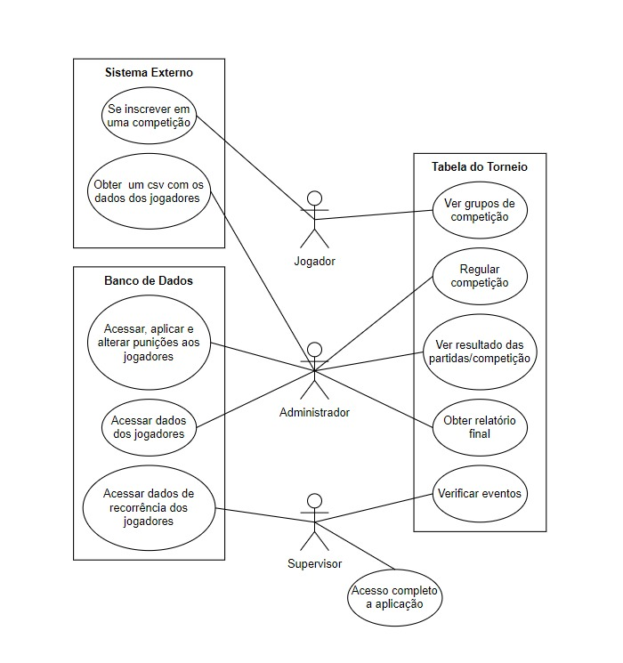

# Declaração de escopo - Matcher

## Histórico de Revisão

| Data       | Versão | Descrição              | Autor(es)                                                    |
| ---------- | ------ | ---------------------- | ------------------------------------------------------------ |
| 16/10/2023 | 0.1    | Criação do documento   | Lucas Queiroz João Eduardo Rodrigo Mattos              |
| 23/10/2023 | 1.0    | Documento para entrega | Lucas Queiroz Lucas Meireles João Pedro Rodrigo Mattos |

##      Problema/Sistema de software

### Definição da equipe de trabalho

| Aluno                                      | Matrícula |
| ------------------------------------------ | --------- |
| JOÃO EDUARDO PEREIRA RABELO                | 180053299 |
| FABIO ALESSANDRO TORRES SANTOS             | 200037170 |
| JOAO PEDRO DA SILVA RODRIGUES              | 211031074 |
| LUCAS HENRIQUE LIMA DE QUEIROZ             | 190091703 |
| LUCAS OLIVEIRA MEIRELES                    | 190016647 |
| PHILIPE BARBOSA DE MORAIS                  | 211062830 |
| RODRIGO MATTOS DE FIGUEIREDO AYRES BEZERRA | 180108875 |

### Declaração do problema, metodologia, tecnologias e atividades

O chaveamento de torneios de e-sports para algumas formas especiais de competição é realizado manualmente, de forma que organizadores precisam verificar longos arquivos .csv para definir os confrontos. O Matcher surge como uma oportunidade para automatizar esse processo. Além disso, ele será usado para reconhecer dados repetidos em torneios separados e para gerar relatórios de torneios.
 

Utilizaremos, como tecnologias, React com Typescript, para o Front-end. Para o Back-end, utilizaremos o SGBD MySQL, o ambiente de runtime NodeJS, também com Typescript, o ORM Prisma e o framework Express. Também usaremos o Docker para conteinerização. Git e Github serão empregados no versionamento do software. O MkDocs será usufruído para a documentação. Escolhemos essas tecnologias porque alguns membros do grupo já as conhecem.
 

Nossa abordagem é ágil, com ciclo de vida ScrumXP. Com base no Scrum vamos utilizar dos rituais de Daily Scrum, Sprint Planning, Sprint Review e Sprint Retrospective. A duração de uma sprint é de uma semana. Além disso, vamos aproveitar as técnicas de Pair Programming, Code Review e Integração Contínua. 
 

Vamos utilizar as métricas Velocity e Throughput. Como abordagem de testes, usaremos de Testes Unitários e de Integração. Escreveremos os testes unitários ao longo da implementação de uma história de usuário.

## Backlog do Produto

### Perfis de acesso

| #    | Nome do perfil | Características do perfil                                    | Permissões de acesso                                         |
| ---- | -------------- | ------------------------------------------------------------ | ------------------------------------------------------------ |
| 1    | Supervisor     | Responsável por verificar e analisar todos os aspectos a todo momento da realização dos eventos. É também a pessoa capaz de acessar dados extras de recorrências de jogadores e/ou vencedores nos eventos. | Acesso completo às funcionalidades da aplicação.             |
| 2    | Administrador  | Será o principal indivíduo a organizar a competição, sendo responsável por indicar quais serão os jogadores e grupos de partidas, além de ser o suporte ativo durante todo o decorrer do evento para garantir que este ocorra e os jogadores estejam seguindo os procedimentos e regras. | Acesso a dados dos jogadores, grupos da competição, resultados de partidas, relatório final. |
| 3    | Jogador        | Indivíduo que não possui permissões de organização, seu uso é limitado a ter o conhecimento de qual o grupo a que pertence na competição. | Grupos de tabela ao qual pertence.                           |

### Cenários 

| Numeração do cenário | Nome do cenário                     |
| -------------------- | ----------------------------------- |
| 1                    | Processamento de arquivo CSV        |
| 2                    | Agrupamento de confrontos           |
| 3                    | Partidas                            |
| 4                    | Persistência de dados dos jogadores |

### Backlog do produto

| Numeração (Cenário/Requisito) | Nome do requisito                                       | Tipo de requisito | Priorização do requisito | Descrição sucinta do requisito                               | User Stories associadas |
| ----------------------------- | ------------------------------------------------------- | ----------------- | ------------------------ | ------------------------------------------------------------ | ----------------------- |
| C1-R1                         | Importação de CSV                                       | Funcional         | Must                     | A aplicação importa um arquivo CSV.                          | US 1                    |
| C1-R2                         | Interpretação de CSV                                    | Funcional         | Must                     | A aplicação interpreta e organiza os dados do CSV.           | US 1                    |
| C1-R3                         | Visualização de dados                                   | Funcional         | Must                     | A aplicação apresenta os dados organizados do CSV ao usuário | US 1                    |
| C2-R1                         | Sortear as chaves                                       | Funcional         | Must                     | Sorteio dos nomes de jogadores                               | US 2                    |
| C2-R2                         | Exportação de tabela                                    | Funcional         | Should                   | Exportação de uma tabela dos confrontos                      | US 3                    |
| C3-R1                         | Confirmar presença dos jogadores                        | Funcional         | Should                   | Deverá ser possível confirmar e registrar os nomes que compareceram à partida ou não. | US 4                    |
| C3-R2                         | Punir jogadores                                         | Funcional         | Could                    | Deverá ser possível registrar punições em jogadores durante o evento | US 5                    |
| C3-R3                         | Receber dados da partida                                | Funcional         | Could                    | Receber os dados de uma partida, após o seu fim.             | US 6                    |
| C3-R4                         | Busca de dados de partida                               | Funcional         | Should                   | Buscar os dados de uma partida utilizando API externa.       | US 6                    |
| C3-R5                         | Registro manual dos vencedores                          | Funcional         | Must                     | Registrar manualmente a posição final dos jogadores do grupo na rodada. | US 6                    |
| C3-R6                         | Obtenção de vencedores de cada grupo                    | Funcional         | Must                     | A aplicação deverá ser capaz de identificar os vencedores de cada grupo por rodada. | US 6                    |
| C4-R1                         | Obtenção de vencedores de competição                    | Funcional         | Should                   | A aplicação deverá ser capaz de repassar ao usuário o resultado final da competição. | US 7                    |
| C4-R2                         | Persistir dados do torneio                              | Funcional         | Should                   | A aplicação deverá registrar a informação dos jogadores em documento geral para frequências de participantes e vencedores. | US 7 e US 8             |
| C4-R3                         | Gerar relatório do torneio                              | Funcional         | Should                   | A  aplicação deverá ser capaz de emitir um relatório de finalização do evento | US 8                    |
| C4-R4                         | Emitir os dados de torneios de um conjunto de jogadores | Funcional         | Should                   | A aplicação deve ser capaz de emitir um relatório do banco de dados de todos os eventos | US 9                    |
| C4-R5                         | Armazenar dados dos jogadores                           | Funcional         | Should                   | A aplicação armazena os dados dos jogadores recebidos via CSV no banco de dados | US 9                    |
| RNF1                          | Usabilidade                                             | Não funcional     | Must                     | A aplicação deverá conter as cores principais da empresa Megalodon, sendo elas Azul, Preto e Branco. A aplicação não poderá ter cores claras como composição principal de suas telas. | -                       |
| RNF2                          | Desempenho                                              | Não funcional     | Must                     | A aplicação não poderá ter tempo de resposta superior a 1 minuto entre ações. | -                       |
| RNF3                          | Segurança                                               | Não funcional     | Must                     | O acesso aos recursos dos sistemas deve ser limitado a cada perfil de usuário, seguindo as especificações dos perfis de acesso. | -                       |
| RNF4                          | Suportabilidade                                         | Não funcional     | Must                     | O sistema deve funcionar para navegadores Google Chrome cuja versão é maior ou igual a 118.0.5993.88. | -                       |
| RNF5                          | Confiabilidade                                          | Não funcional     | Must                     | O administrador deve ser capaz de identificar mensagens de erro auto-explicativas em ações que venham a falhar durante o uso da aplicação. O sistema deve manter os dados recebidos salvos para que consiga recuperá-los em caso de parada total do sistema por problemas com baixa previsibilidade, como perda de conexão. | -                       |

### Sprints previstas

| # Sprint | Descrição                                      | Objetivos                                                    | Composição de itens do backlog(lista conforme tabela Backlog do produto) |
| -------- | ---------------------------------------------- | ------------------------------------------------------------ | ------------------------------------------------------------ |
| 1        | Pré-requisitos para os itens da próxima sprint | Gerar os itens prévios para a realização dos requisitos de C2-R1 e C2-R2 | C1: R1, R2 e R3                                              |
| 2        | Iniciar requisitos de chaveamento              | Iniciar o desenvolvimento da parte com valor de negócio para o cliente do produto | C2: R1 e R2                                                  |
| 3        | Itens para registro de resultados              | Completa a sequência de ações para prosseguir com o torneio. | C3: R3, R5 e R6                                              |
| 4        | Itens para controle de presença                | Expande a quantidade de ações para realização de partidas pelo administrador para controle de jogadores no torneio. | C3: R1 e R2                                                  |
| 5        | Resultado automatizado e vencedores            | Integrar o sistema à API já existente da empresa do jogo foco para identificar o resultado de partida e trazer informe dos vencedores da competição | C3-R4 e C4-R1                                                |
| 6        | Dados de jogadores entre torneios              | Os dados dos jogadores são registrados em um banco de dados persistentes para registrar frequências e vitórias de jogadores | C4: R2 e R5                                                  |
| 7        | Relatórios de informações para uso comercial   | Finalizar os itens de valor de negócio para o cliente para uso externo. | C4: R3 e R4                                                  |

### Definição de ready/done

Definition of Ready: a história de usuário deve estar no formato: “Eu, como <Role>, quero/desejo/necessito <verbo no infinitivo> para que <descrição do objetivo do usuário com aquela funcionalidade>". Além disso, os critérios de aceitação devem estar de acordo com as regras de negócio, e os habilitadores técnicos devem estar bem definidos.
 

Definition of Done: a história deve ter testes unitários escritos e passar em 100% deles. Além disso, testes anteriores de histórias anteriores não podem ser quebrados. A história deve passar por integração contínua. O código novo deve passar por uma revisão por outro membro da equipe. Todo o código novo (classes, métodos, funções, variavéis novas, etc) deve estar bem documentado no próprio código.

### US - User Stories

Todas as User Stories estarão sujeitas a todos os critérios de Ready e Done descritos acima.

| Identificador | Descrição                                                    | Técnica de elicitação |
| ------------- | ------------------------------------------------------------ | --------------------- |
| US1           | Eu, como administrador, desejo enviar o CSV com os dados dos jogadores do torneio à aplicação para que possa identificar quem está presente e suas informações de cadastro. | Brainstorm            |
| US2           | Eu, como administrador, desejo realizar o sorteamento dos grupos da competição para que então os jogadores possam prosseguir com o torneio. | Brainstorm            |
| US3           | Eu, como jogador, desejo visualizar o grupo em que fui sorteado para que consiga realizar a disputa com os oponentes corretos. | Brainstorm            |
| US4           | Eu, como administrador, desejo ser capaz de registrar e identificar jogadores que não compareceram às suas partidas, assim tendo acesso à lista correta do resultado dos jogadores. | Brainstorm            |
| US5           | Eu, como administrador, desejo ser capaz de registrar punições à jogadores quando necessário para que possa manter um bom controle das regras do evento e de um ambiente esportivo com o devido respeito. | Brainstorm            |
| US6           | Eu, como administrador, desejo registrar os vencedores de cada grupo em cada rodada para que o evento possa prosseguir até sua finalização. | Brainstorm            |
| US7           | Eu, como administrador, desejo receber os vencedores da competição para que possa identificá-los e registrar sua conquista aos demais jogadores via canal de comunicação externo. | Brainstorm            |
| US8           | Eu, como administrador, desejo receber os dados necessários para realizar o relatório ao final do evento para que os vencedores possam receber suas premiações. | Brainstorm            |
| US9           | Eu, como supervisor, desejo acessar as informações de frequência de participação e vitórias de um ou mais jogadores quando analisados no decorrer de diversos torneios e/ou tempo específico para que possa ter esses dados. | Brainstorm            |

## Diagrama de casos de uso

## MVP

Para o MVP, o cliente, juntamente com os desenvolvedores, chegou em um consenso para serem trabalhadas as U.S.s de numerações 1, 2, 3, 6, 7. Estas são as histórias que delimitam a maior necessidade do cliente no momento e trarão retorno mais rápido e viável ao cliente quando se trata de valor de negócio. As histórias 4 e 5 são itens adicionais que o mesmo já realiza de modo externo e que não necessitam de desenvolvimento rápido ou com urgência, pois o valor de negócio é menor e mais voltado ao controle interno da qualidade do torneio. As histórias 8 e 9 são relacionadas a itens dos torneios, mas também itens extras para uso do cliente em reuniões externas, análise de dados e desempenho de sua empresa, não necessariamente ligado à execução do torneio em si, que é o foco do produto a ser desenvolvido.
 Foi definido com o cliente que no caso de o desenvolvimento não conseguir abranger os itens externos ao MVP, que eles seriam desenvolvidos durante a primeira atualização do produto para potencial integração a uma aplicação externa.

## Referências

SCHWABER, Ken; SUTHERLAND, Jeff. **Guia do Scrum:** as regras do jogo. 2ª ed. Rio de Janeiro: Elsevier, 2020.

BECK, Kent. **Programação extrema (xp) explicada**: acolha as mudanças. Porto Alegre: Bookman, 2004.

Nimble. **What is velocity in agile?**. Disponível em: [https://www.nimblework.com/agile/what-is-velocity/.](https://www.nimblework.com/agile/what-is-velocity/) Acesso em: 16 de outubro de 2023.

MACKESY-BUCKLEY, Austin. **The Dark Horse Metric: a case for using Throughput**. Disponível em: https://medium.com/swlh/the-dark-horse-metric-a-case-for-using-throughput-c486094913a0. Acesso em: 23 de outubro de 2023.

Businessmap. **6 Agile Metrics that matter**. Disponível em: [https://businessmap.io/agile/project-management/agile-metrics#:~:text=2.-,Throughput,weekly%2C%20monthly%2C%20etc](https://businessmap.io/agile/project-management/agile-metrics#:~:text=2.-,Throughput,weekly%2C monthly%2C etc). Acesso em: 16 de outubro de 2023.
